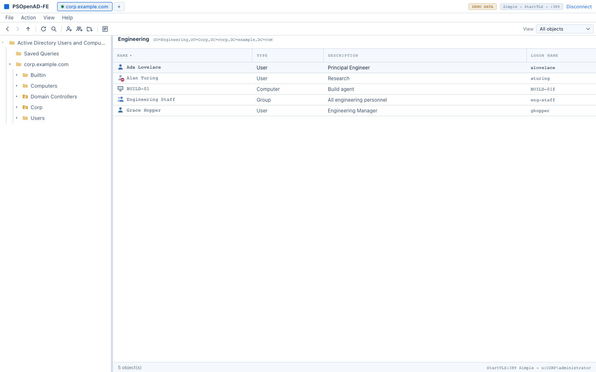
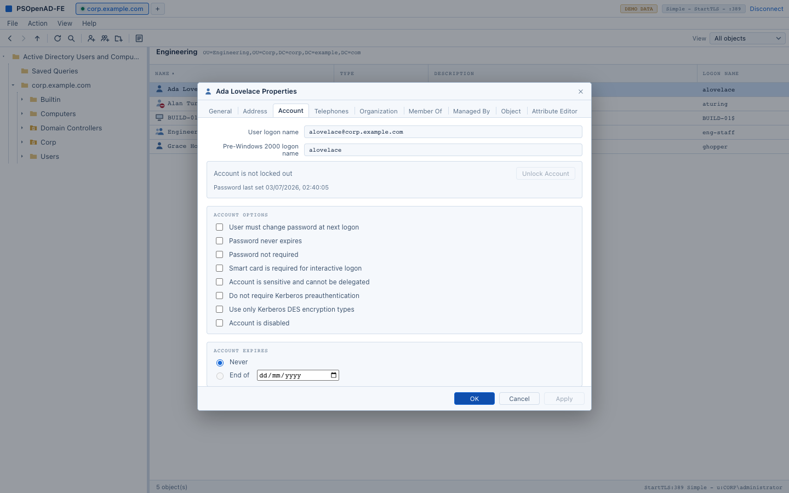
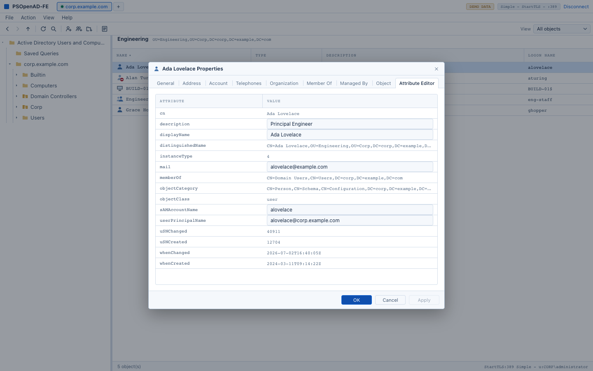

# PSOpenAD Front End

Cross-platform Tauri desktop UI for [PSOpenAD](https://github.com/MacsInSpace/PSOpenAD) (fork of [jborean93/PSOpenAD](https://github.com/jborean93/PSOpenAD)). Aims toward Active Directory Users and Computers-style management on Mac, Windows, and Linux via PowerShell 7.

## Install

Download the DMG from [Releases](https://github.com/MacsInSpace/PSOpenAD-FE/releases)
and drag the app to Applications. **PowerShell 7 is the only thing you need to
install separately** - everything else, including PSOpenAD itself, is inside the
bundle. If it is missing, the app says so at startup and offers the download.

The build is signed with a Developer ID and **notarised** by Apple, so it opens
normally on a machine with internet access - Gatekeeper fetches the notarisation
ticket at first launch.

The ticket is not stapled into the bundle, which matters in one case: a machine
with **no route to Apple** at first launch cannot fetch it, and macOS then
refuses to open the app. Clear the quarantine flag if that is you:

```bash
xattr -dr com.apple.quarantine /Applications/PSOpenAD.app
```

`-d` deletes that one attribute and `-r` applies it through the bundle; without
`-r` only the top-level folder is cleared and the app still refuses to launch.
Avoid `-c`, which strips every extended attribute rather than just the
quarantine flag. Code signing is unaffected either way - verify with
`codesign --verify --deep --strict /Applications/PSOpenAD.app`.

## Try it without a domain controller

The connect screen offers **Explore with sample data**: a small invented forest
of users, groups, computers and OUs that answers entirely locally. Nothing is
contacted, nothing can be changed, and the title bar shows a **DEMO DATA**
badge throughout. It is the fastest way to see whether this is the tool you
want, and it needs no directory, no account and no PowerShell.

## Several directories at once

Connections are saved and shown as tabs across the top, so a technician working
across several sites switches between them without reconnecting. Each saved
connection keeps its server, username, label and bind method; the password is
kept in an encrypted local vault, described under Prerequisites.

## What it looks like

An MMC console, on purpose. Menu bar, toolbar, console tree, result pane,
status bar - and ADUC's exact verb wording, so anyone who has used Active
Directory Users and Computers already knows how to drive it.



- **Tree** - `Active Directory Users and Computers [dc]` -> Saved Queries -> the
  domain -> its containers, loaded as you expand them; Deleted Objects appears
  under the domain when the forest has the Recycle Bin enabled
- **List** - Name / Type / Description / Logon name by default; View > Add/Remove
  Columns to change it; sortable, keyboard navigable, multi-select with bulk
  verbs
- **Right-click** anything for its verbs; **double-click** or **Alt+Enter** opens
  the tabbed Properties sheet
- **Ctrl+F** finds across the domain and drops the results in Saved Queries;
  **F5** refreshes; **Alt+<-/->** walk the navigation history
- Light and dark, following the system setting



Every verb is live: New (user, group, computer, contact, OU), Move (browse for
the destination), Rename, Delete, Copy from a template, Enable/Disable, Unlock,
Reset Password, account options and expiry, Members and Member Of with an
object picker, Managed By, protect from accidental deletion, Restore from the
Recycle Bin, Operations Masters, and a computer's Reset Account.



The screenshots are of the built-in demo forest (`corp.example.com`), which is
fictional. Nothing in this repository refers to a real directory.

Design rules live in [`docs/PSOPENAD_FE_StyleGuide.md`](docs/PSOPENAD_FE_StyleGuide.md).

## Stack

| Layer | Tech |
|-------|------|
| UI | Tauri 2 + React + TypeScript |
| Dev server | Vite on **14320** (not 1420/1490) |
| LDAP | PSOpenAD via long-running `pwsh` sidecar |
| Auth | Username / password; multi-domain session tabs |

## Connection ladder

On connect (standard channel), the sidecar tries steps least -> most secure (first success wins). TLS steps use `-SkipCertificateCheck` (suitable for IP binds against an internal CA):

1. LDAP :389 Simple (plain)  
2. StartTLS :389 Simple  
3. LDAP :3268 GC Simple (plain)  
4. StartTLS :3268 GC Simple  
5. LDAPS :636 Simple  
6. LDAPS-GC :3269 Simple  

Override with `APP_LDAP_PORTS` (comma-separated port filter). Short connect timeouts on early steps; longer on the last.

See [about_OpenADSessions](https://github.com/MacsInSpace/PSOpenAD/blob/main/docs/en-US/about_OpenADSessions.md) and [New-OpenADSession](https://github.com/MacsInSpace/PSOpenAD/blob/main/docs/en-US/New-OpenADSession.md).

**Upstream module:** this app depends on [MacsInSpace/PSOpenAD](https://github.com/MacsInSpace/PSOpenAD) (not a fork of that repo - separate front-end). Rebuilds and `-TargetSpnHost` patches track that tree; pending merges there will be picked up on the next vendor rebuild.

## Project conventions

Two rules, both carried over from an earlier project where ignoring them cost real debugging
time. `scripts/lint-conventions.ps1` enforces them; run it before you commit.

```bash
pwsh -File ./scripts/lint-conventions.ps1          # check, exits non-zero on failure
pwsh -File ./scripts/lint-conventions.ps1 -Fix     # apply the mechanical fixes
```

### 1. StrictMode

Every PowerShell file declares `Set-StrictMode -Version Latest`, including the
dot-sourced libs, which would otherwise only inherit it. StrictMode turns a
silently-wrong value into a loud failure, which is what you want from something
that writes to a directory.

The traps it catches, all of which have bitten this project:

| Pattern | What goes wrong |
| --- | --- |
| `@(x) \| Where-Object {...}` then `.Count` | The pipeline yields a **scalar** for a single match, so `.Count` throws. Wrap the whole pipeline: `@(@(x) \| Where-Object {...})` |
| `return @()` from a function | An empty array **unrolls to `$null`**, so a list method answers `null` instead of `[]` |
| `$obj.Maybe` | Accessing a property that is not there throws. Use `$obj.PSObject.Properties['Maybe']` |
| `$args = @{...}` | `$args` is an **automatic variable**; assigning to it inside a function shadows it |

PSScriptAnalyzer runs as part of the lint, at Error and Warning, with a short
list of deliberate exclusions documented in the script.

### 2. ASCII only

No em-dashes, no box drawing, no smart quotes, no emoji, in any source or
documentation file. Not a style preference:

- a comment-only difference in non-ASCII characters was enough to make a whole
  patch fail to apply, and then fail to *reverse*-apply, so tooling could not
  tell an applied patch from a rotted one
- non-ASCII renders inconsistently across terminals, editors and diff viewers,
  which makes a diff harder to read at exactly the moment you need it

Where the UI genuinely needs a glyph, keep the **source** ASCII and let the
rendered output carry it: an HTML entity in JSX text (`&#10005;`), or a
`\uXXXX` escape in a JavaScript string. `vendor/` and `PSOpenAD/` are exempt,
being other people's code.

## Prerequisites

- [PowerShell 7.4+](https://github.com/PowerShell/PowerShell) (`pwsh` on PATH)
- Rust (stable) + Node.js 20+

Saved connections keep their non-secret details (server, username, label, bind
method) under the app data directory. Passwords go to an encrypted local vault -
`SecretManagement.LocalVault`, vendored under `vendor/psmodules` - and never
into that file.

**No OS credential store is used**: no macOS Keychain, no Windows Credential
Manager, no Linux Secret Service. Keychain item ACLs bind to the accessing
binary's code-signing identity, so every rebuild produced a fresh prompt; the
vault avoids the category rather than working around it. On macOS and Linux the
store is AES-256-GCM under a key derived from this machine and this user, so a
copied profile directory is unreadable elsewhere; Windows uses DPAPI. Nothing
prompts, and a vault that cannot be read degrades to typing the password each
time rather than failing.

This repo ships a **patched** build under `vendor/PSOpenAD` (includes `-TargetSpnHost` for Kerberos-by-IP). Prefer that over the gallery package when using the Kerberos seal channel.

Optional: `PSOPENAD_MODULE_PATH` pointing at a built module `.psd1`.

Rebuild:

```bash
cd PSOpenAD
pwsh -File ./build.ps1 -Task Build -Configuration Release
# copy output/PSOpenAD/<version>/* -> ../vendor/PSOpenAD/
```

## Kerberos / unicodePwd

Password sets need a confidential channel:

1. A TLS session (StartTLS or LDAPS) can set `unicodePwd` directly.
2. When the DC has no usable LDAPS cert: connect with **Kerberos sign+seal :389**, or call `setPassword` which opens a sealed session for the write.

Requires system `kinit` / `kgetcred` (macOS: `/usr/bin/kinit`, `/usr/bin/kgetcred`) and the patched module with `-TargetSpnHost`.

## Develop

```bash
cd app
npm install
npm run tauri:dev
```

Vite listens on `http://localhost:14320`.

| Script | Does |
| --- | --- |
| `npm run tauri:dev` | The desktop app, with hot reload |
| `npm run tauri:build` | A packaged build |
| `npm run dev` | Front end only, in a browser - see Demo mode below |
| `npm run typecheck` | `tsc --noEmit` |
| `npm run lint:conventions` | StrictMode and ASCII checks (see Project conventions) |

### Demo mode

The same sample forest offered on the connect screen (see above). Running the
front end **without** Tauri serves it automatically, since there is no sidecar
to talk to:

```bash
cd app
npm run dev          # http://localhost:14320
```

In a packaged build it is off until asked for. Either way the title bar shows a
**DEMO DATA** badge while it is active, and writes are refused - see
`app/src/lib/demo.ts`.

## Layout

```
PSOpenAD-FE/
  app/                 # Tauri + React
    src/components/    # console tree, object list, menus, property sheet
    src/lib/adTerms.ts # ADUC's exact verb wording, in one place
    src/lib/demo.ts    # sample forest for running without a DC
  sidecar/             # JSON-lines PowerShell bridge
    OpenADSidecar.ps1
    lib/ConnectionLadder.ps1
    lib/KerberosSealed.ps1
    lib/Attributes.ps1
  vendor/PSOpenAD/     # Patched module build
  PSOpenAD/            # Module source
```

## Sidecar protocol

Newline-delimited JSON over stdin/stdout:

```json
{"id":"1","method":"connect","params":{"server":"dc.example.com","username":"DOMAIN\\user","password":"P","domainKey":"prod","channel":"standard"}}
```

Methods: `ping`, `ladder`, `connect`, `disconnect`, `listSessions`, `getChildren`, `listContents`, `search`, `getObject`, `getGroupMembers`, `getRootDse`, `probePasswordChannel`, `setPassword`, `quit`.
